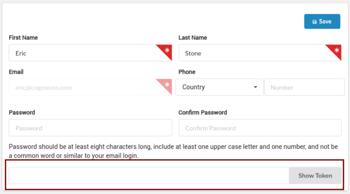
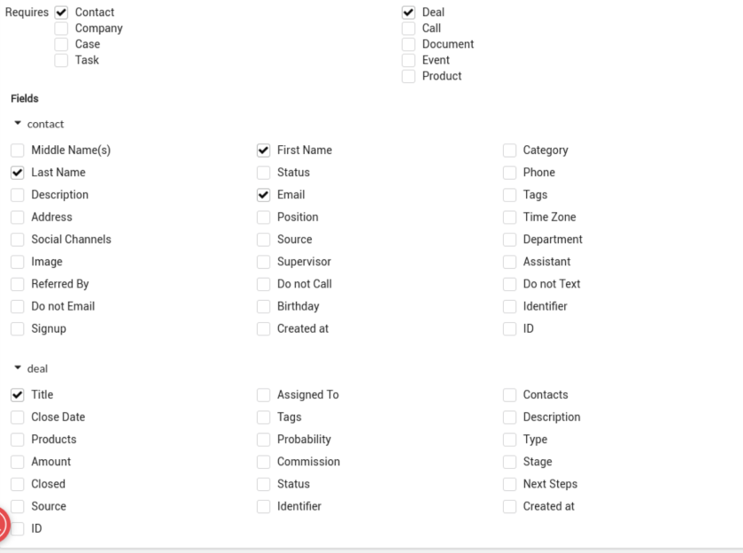
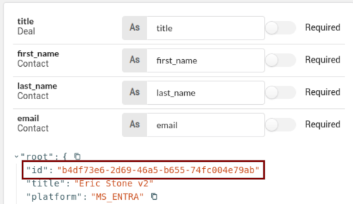

# Cogmento CRM - Verified Credentials Demo 

Cogmento CRM, other than being a very powerful and hyper-configurable CRM platform, is also a VCM. 
A VCM allows you to manage the issuance and verification of verified credentials at scale.  The marriage of CRM and VCM is perfect, as you already hold the subject data and can use it to create elaborate schemas that represent your data and processes and encapsualte them in a credentials. 

Curently Cogmento CRM implements verified credentials on top of Microsoft's platform which means the credentials can be held and presented using the MS Authenticator application. 

## This demo

This small web application is a demonstration of how a simple integration with Cogmento can lead to both the collection of contact information while issuing the person a verified credntial which they can later present for verification. 

## Before running the demo 

First, you will need to create an account on Cogmento CRM and collect your API token associated with a user. 
You can find your API token in the User Manager section which is  under Settings:

You will also need to create a Verified Credentials Schema. Schemas define what is actually __in__ your credential. For this demo we'd like a credential that encapsulates a contact and deal records. In the schema form you'll have __Contact__ and __Deal__ both checked. Within those record types, select __First Name__, __Last Name__, __Email__ and the Deal's __Title__. Thoes are the fields we will include in our Verified Credential.

The rest of the Schema configuration is up to you. 

You will require the schema id, which is available to the right after the schema is created (within the JSON representation of it):

Optionally, if you'd like to use reCaptcha for the public submission form, collect your reCaptcha account's key and secret as well. 

Copy the file `.env.sample` from the root of this directory to a new file named `.env` and set the values within to those collected, i.e., the API token, Schema id and optionally reCaptcha key and secret. 

## Running the demo 

To run the web app demo you can either use the `run.sh` shell script, or utilise the Docker container setup.

That is, either: 

`./run.sh` 

or 
 
`docker run --rm -it -p 8000:8000 $(docker build -q .)`

## Using the app

The app will generate the contact and deal records for whomever fills in the form presented at `http://localhost:8000` (which of course in a real deployment you'll present under https and a valid domain). As a response the person will be presented with a credential they can scan into MS Authenticator's Identity wallet. 
